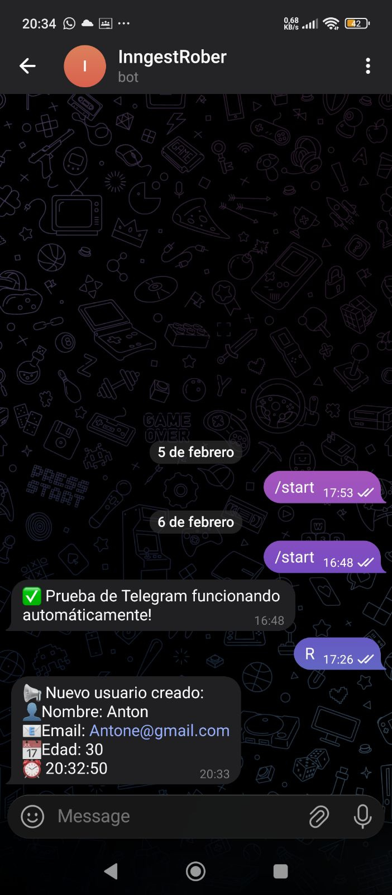

# **INNGEST: NOTIFICACIONES DE CREACIÓN DE USUARIOS**

## **Objetivo:**
En esta práctica, utilizando una API previamente creada que incluye un **CRUD de usuarios y grupos**, implementaremos **Inngest** para la gestión de eventos y configuraremos un **bot de Telegram** que envíe notificaciones automáticas cada vez que se crea un nuevo usuario.

---

## **Descripción**

Esta práctica consiste en modificar una API existente con las siguientes características:

- **CRUD de usuarios y grupos** en MongoDB
- **Notificaciones automáticas** vía Telegram cada vez que se crea un nuevo usuario
- Integración con **Inngest** para el manejo de eventos

Cada vez que se hace un POST a `/iniusuario`:

1. Se guarda el usuario en MongoDB  
2. Se dispara un evento `nuevo.usuario` en Inngest  
3. La función `NotiNewUser` envía un mensaje al bot de Telegram con los datos del usuario  

---

## **Tecnologías utilizadas**

- Node.js  
- Express  
- Inngest  
- Telegram Bot API  
- MongoDB  
- dotenv  
- Axios  

---

## **Variables de entorno**

Crear un archivo `.env` en la raíz del proyecto con las siguientes variables:

```env
TOKEN_BOT_TELEGRAM=tu_token
ID_CHAT_TELEGRAM=tu_chat_id

---
```

## Configurar Telegram
### 1. Obtener Token del Bot

1. Buscamos en Telegram: **@BotFather**
2. Enviamos el comando /start
3. Creamos un nuevo bot siguiendo las instrucciones
4. Telegram nos devolverá el enlace al bot y el token del bot
5. Copiamos el token y lo guardamos en el archivo .env
---




## 2. Obtener el chat id

1. Ir a https://api.telegram.org/bot<TU_TOKEN>/getUpdates, esto es la api de telegram en donde te facilitara obtener tu chat id, para ello deviste de iniciar el chat o mandar algo.
2. Pegar esa url en tu navegador.


## Instalar Dependencias

Ejecutar:

```bash
npm install inngest express node-telegram-bot-api dotenv axios
```
## Creación archivos.


Modificacion del endpoint de crear.


## Iniciar Proyecto, levantar api y servidor de ingest.


## Prueba de crear usuario

Para esta prueba podemos usar deferentes opcion en mi caso use la extension ThunderClient, pero tambien hay otras como Postman o Bruno.


## Comprobacion en el bot


## Comprobacion en el servidor de ingest


